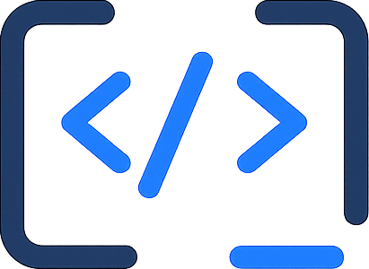
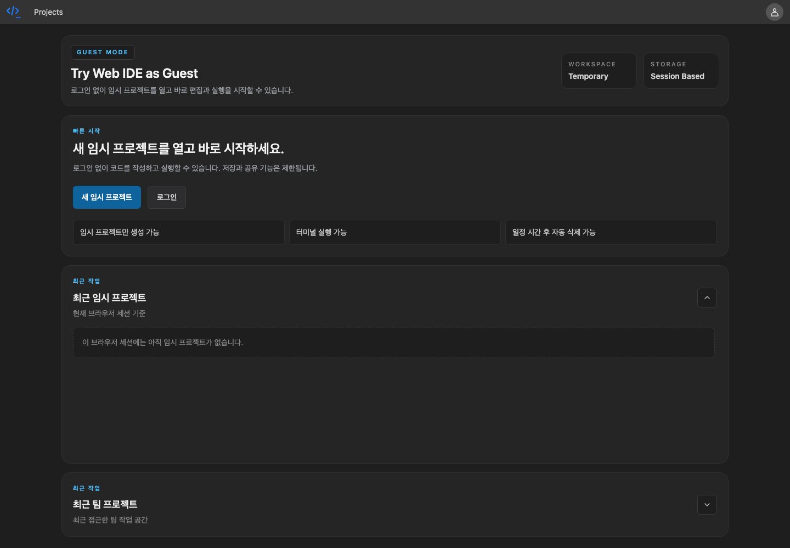
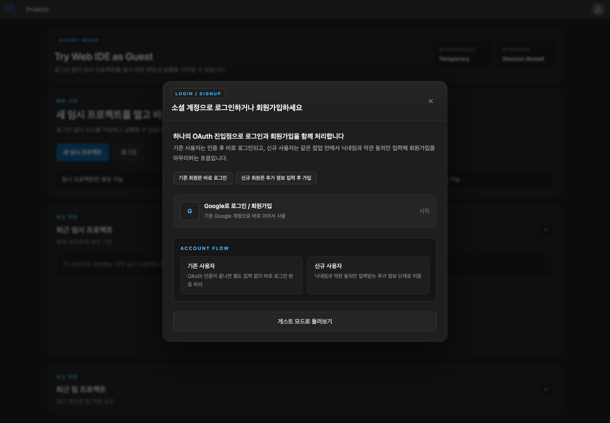
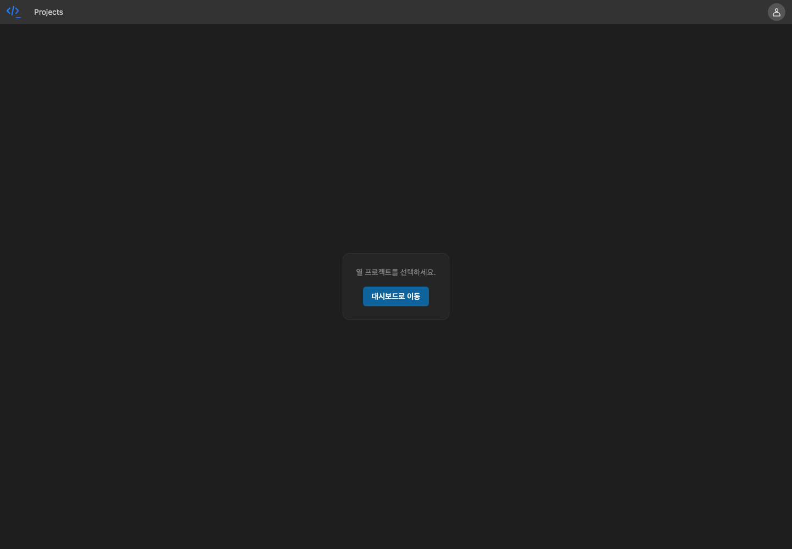
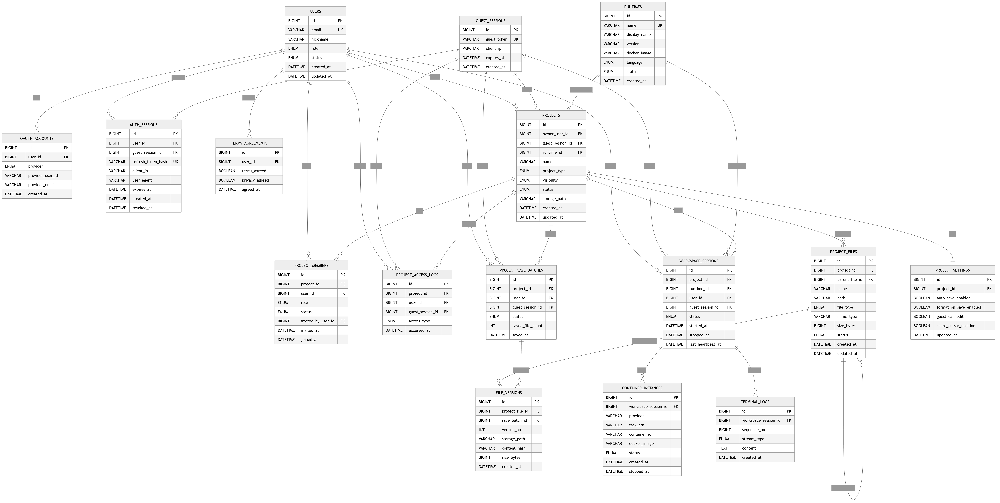

# Dev Web IDE

<div align="center">
  

  [](https://hits.seeyoufarm.com)

</div>

## 프로젝트 정보

> 브라우저에서 프로젝트 생성, 코드 편집, 파일 저장, 실행, 협업을 제공하는 웹 기반 IDE 플랫폼입니다.<br>
> 개발 기간: 2026.04.29 ~ 2026.09.08

## 배포 주소

> 서비스: [https://d1qcnjd8lnakb.cloudfront.net](https://d1qcnjd8lnakb.cloudfront.net)<br>
> API 서버: [https://d15mkrht7zfcoy.cloudfront.net](https://d15mkrht7zfcoy.cloudfront.net)<br>
> API 헬스 체크: [https://d15mkrht7zfcoy.cloudfront.net/api/health](https://d15mkrht7zfcoy.cloudfront.net/api/health)

## 프로젝트 소개

Dev Web IDE는 별도 로컬 개발 환경 설치 없이 브라우저에서 바로 코드를 작성하고 실행할 수 있는 웹 IDE입니다. 게스트 사용자는 임시 프로젝트를 빠르게 생성해 기능을 체험할 수 있고, 로그인 사용자는 프로젝트 저장과 팀 기반 협업 기능을 사용할 수 있습니다.

프론트엔드는 React, Vite, Monaco Editor를 기반으로 IDE 스타일의 작업 화면을 제공하며, 백엔드는 Spring Boot API 서버가 인증, 프로젝트, 파일, 런타임 실행, 터미널 로그, 실시간 협업 데이터를 처리합니다. 프로젝트 파일은 로컬 개발 환경에서는 파일 시스템에, 운영 환경에서는 EFS를 기준으로 저장하도록 설계했습니다.

현재 실행 런타임은 Node.js 20, Python 3.12, Java 21, C++ GCC를 지원합니다.

## 시작 가이드

### Requirements

프로젝트 실행을 위해 다음 환경이 필요합니다.

- [Node.js 24 이상](https://nodejs.org/)
- [pnpm 10.15.1](https://pnpm.io/)
- [JDK 25](https://adoptium.net/)
- [Docker](https://www.docker.com/)
- MySQL 8.x
- Redis 7.x, 실시간 기능 사용 시 선택

### Installation

```bash
git clone https://github.com/yuhyeon99/dev-web-ide.git
cd dev-web-ide
pnpm install
```

### Frontend

```bash
cp FE/.env.example FE/.env
pnpm dev:fe
```

로컬 백엔드를 사용할 경우 `FE/.env`의 API 주소를 수정합니다.

```text
VITE_API_BASE_URL=http://localhost:8080
VITE_REALTIME_WS_URL=ws://localhost:8080
```

### Backend

```bash
cd BE/dev-web-ide
./gradlew bootRun
```

운영 프로필 Docker 이미지 빌드 및 실행 예시는 다음과 같습니다.

```bash
cd BE/dev-web-ide
./gradlew bootJar
docker build -t dev-web-ide-be:local .
cp .env.prod.example .env.prod
docker run --rm --env-file .env.prod -p 8080:8080 dev-web-ide-be:local
```

## Stacks

### Environment


### Config


### Development


### Runtime


### Deploy


## 화면 구성

### 진입 화면

| 게스트 대시보드 | 로그인 / 회원가입 |
| :---: | :---: |
|  |  |

### 핵심 기능 화면

| 게스트모드 워크스페이스 | 워크스페이스 실행 |
| :---: | :---: |
|  | 캡처 예정 |
| 게스트 사용자가 임시 프로젝트를 열고 코드 편집 화면으로 진입하는 흐름입니다. | Node.js, Python, Java, C++ 프로젝트를 실행하고 터미널에서 stdout/stderr 로그를 확인하는 화면입니다. |

| 실시간 팀 채팅 | 팀 초대 및 관리 |
| :---: | :---: |
| 캡처 예정 | 캡처 예정 |
| 팀 프로젝트 워크스페이스에서 참여자끼리 메시지를 주고받는 화면입니다. | 팀원을 초대하고 역할과 권한을 관리하는 화면입니다. |

## 주요 기능

### 프로젝트 관리

- 게스트 임시 프로젝트 생성
- 회원 프로젝트 생성 및 최근 프로젝트 조회
- 팀 프로젝트 생성, 팀원 초대, 권한 변경, 제거
- 프로젝트 열기 이력 관리

### 코드 편집 및 파일 관리

- Monaco Editor 기반 코드 편집
- 파일 트리 조회
- 파일 및 폴더 생성
- 파일 내용 조회와 저장
- 파일명 변경, 삭제
- 파일 버전 저장

### 프로젝트 실행

- Node.js 20: `main.js`
- Python 3.12: `main.py`
- Java 21: `Main.java`
- C++ GCC: `main.cpp`
- 실행 결과를 터미널 로그로 저장하고 화면에 출력

### 인증 및 세션

- Google OAuth 로그인 / 회원가입
- 게스트 세션 발급
- 액세스 토큰 재발급
- 프로필 닉네임 설정

### 실시간 협업

- WebSocket 기반 프로젝트 이벤트 전달
- Yjs 기반 CRDT 업데이트 송수신
- 라이브 파일 콘텐츠 동기화
- 워크스페이스 사용자 presence
- 팀 채팅 메시지 송수신

## API 주소

| Domain | Method | Endpoint | Description |
| --- | --- | --- | --- |
| Health | GET | `/api/health` | 서버 상태 확인 |
| Auth | GET | `/api/auth/oauth/google` | Google OAuth 시작 |
| Auth | POST | `/api/auth/oauth/google/signup` | OAuth 회원가입 완료 |
| Auth | POST | `/api/auth/token/refresh` | 액세스 토큰 재발급 |
| Guest | POST | `/api/guest-sessions` | 게스트 세션 생성 |
| User | GET | `/api/users/me` | 현재 사용자 조회 |
| Project | POST | `/api/projects` | 프로젝트 생성 |
| Project | GET | `/api/projects/my` | 내 프로젝트 목록 조회 |
| Project | GET | `/api/projects/shared` | 공유 프로젝트 목록 조회 |
| Project | POST | `/api/projects/{projectId}/open` | 프로젝트 열기 |
| File | GET | `/api/projects/{projectId}/files/tree` | 파일 트리 조회 |
| File | POST | `/api/projects/{projectId}/files` | 파일 또는 폴더 생성 |
| File | GET | `/api/projects/{projectId}/files/{fileId}/content` | 파일 내용 조회 |
| File | POST | `/api/projects/{projectId}/save` | 파일 저장 |
| Execution | POST | `/api/projects/{projectId}/run` | 프로젝트 실행 |
| Execution | POST | `/api/workspace-sessions/{workspaceSessionId}/stop` | 실행 세션 중지 |
| Terminal | GET | `/api/workspace-sessions/{workspaceSessionId}/terminal/logs` | 터미널 로그 조회 |
| Runtime | GET | `/api/runtimes` | 런타임 목록 조회 |

## 아키텍처

```text
Browser
  -> CloudFront
  -> S3 Frontend Hosting
  -> Spring Boot API Server on ECS/Fargate
  -> RDS MySQL
  -> EFS Project Storage
  -> Redis Realtime Pub/Sub
```

<div align="center">
  
</div>

### 디렉터리 구조

```text
.
├── BE/
│   └── dev-web-ide/
│       ├── src/main/java/com/yuhyeon/devwebide/
│       │   ├── auth/          # OAuth, JWT, guest session
│       │   ├── common/        # 공통 응답과 예외 처리
│       │   ├── execution/     # 프로젝트 실행과 컨테이너 세션
│       │   ├── project/       # 프로젝트, 파일, 팀 멤버, 저장
│       │   ├── realtime/      # WebSocket, Redis pub/sub, 협업 이벤트
│       │   ├── runtime/       # 실행 런타임 메타데이터
│       │   ├── terminal/      # 터미널 로그
│       │   ├── user/          # 사용자와 프로필
│       │   └── workspace/     # 워크스페이스 세션
│       ├── src/main/resources/
│       ├── docs/
│       ├── build.gradle
│       └── Dockerfile
├── FE/
│   ├── src/
│   │   ├── app/               # 라우터
│   │   ├── features/          # 인증, 프로젝트 생성, 프로젝트 열기
│   │   ├── pages/             # dashboard, workspace, profile setup
│   │   ├── shared/            # API client, config, realtime client
│   │   └── widget/            # 공통 헤더
│   ├── package.json
│   └── vite.config.ts
├── docs/
│   ├── readme/                # README 화면 캡처
│   └── submission/            # 제출 산출물
├── package.json
├── pnpm-workspace.yaml
└── README.md
```

## 추가 문서

- [백엔드 아키텍처 문서](./BE/dev-web-ide/docs/architecture.md)
- [데이터베이스 스키마](./BE/dev-web-ide/docs/database-schema.md)
- [구현 완료 체크리스트](./BE/dev-web-ide/docs/implementation-completion-checklist.md)
- [제출 산출물 안내](./docs/submission/README.md)
